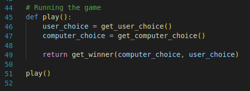

# Computer Vision RPS
This is an implementation of the Rock-Paper-Scissors game using the [Teachable-Machine](https://teachablemachine.withgoogle.com/) computer vision system to detect the option (Rock, paper or scissors) the user is showing to the computer. This model was created using sample images of myself showing each option to the camera to train the different classes. A class named "Nothing" was used to represent the lack of an option being shown to the camera. The accuracy of the model depended heavily on the amount of samples used to train each class, and for robustness, a minimum of 1,000 was used to train each category. 

The trained model files are saved in the repository as `keras_model.h5` and `labels.txt`, which contain the structure/parameters of the model and the labels of the classes respectively. 

## Milestone 1

- The development environment for the project was set up, along with Github integration for the project.
  
```python
"""Insert your code here"""
```

## Milestone 2

- In this milestone, the model was created using sample images of myself showing each option to the camera to train the different classes. A class named "Nothing" was used to represent the lack of an option being shown to the camera. The accuracy of the model depended heavily on the amount of samples used to train each class, and for robustness, a minimum of 1,000 was used to train each category. 

- The trained model files are saved in the repository as `keras_model.h5` and `labels.txt`, which contain the structure/parameters of the model and the labels of the classes respectively. 

## Milestone 3

- This stage was soley for creating the virtual environment and installing required dependencies/libraries. Furthermore, the model was tested to verify functionality and that it produces the desired output. The output of the model is stored in the `probabilities` variable as a list, and each element corresponds to the probability of the input image representing a particular class.

## Milestone 4

- Here, the objective was creating a manual rock-paper-scissors game which prompts the user for an input and compares this to a random choice by the computer following the logic of the game.

- All the steps in this stage were carried out without the camera. The random module was used to pick a choice for the computer;the user's was gotten using the built-in `input()` function. Two functions were used to achive the aforementioned steps: `get_computer_choice()` and `get_user_choice()`. The entire script was stored in the manual_rps.py file. A screenshsot of these functions is included below


- Furthermore, a new function called `get_winner` was created to choose a winner based on the classic rules of Rock-Paper-Scissors game using if-elif-else statements. This function takes two arguments: `computer_choice` and `user_choice` and prints out a message depending on if the user wins, loses or draws with the computer.
A screenshot of this function is included below


- Finally a last function called `play()` was defined within the script that calls all the functions defined earlier(get_computer_choice, get_user_choice, and get_winner). This function is then called to play a game of Rock-Paper-Scissors, and print out the winner.

